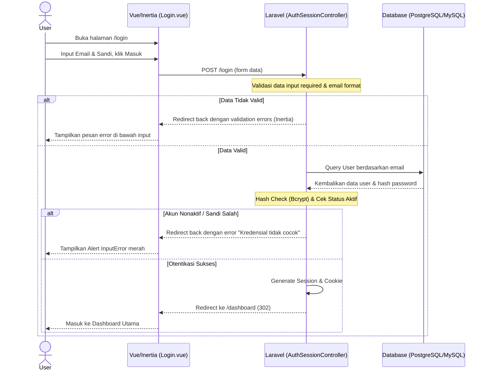

# DOKUMENTASI SISTEM: HALAMAN LOGIN

Dokumentasi ini menjelaskan secara mendalam arsitektur, antarmuka, fungsionalitas, keamanan, dan alur kerja teknis dari **Halaman Login** pada Aplikasi Inventory.

---

## 1. STRUKTUR & METADATA FILE
*   **Rute Web (Laravel):** `Route::get('/login', [AuthenticatedSessionController::class, 'create'])->name('login');`
*   **Controller:** `app/Http/Controllers/Auth/AuthenticatedSessionController.php`
*   **File UI (Vue 3 / Inertia):** `resources/js/Pages/Auth/Login.vue`
*   **Layout Utama:** Halaman ini berdiri sendiri (tidak menggunakan `AuthenticatedLayout`).

---

## 2. DESAIN ANTARMUKA & UI/UX (PREMIUM TASTE)
Halaman login dirancang menggunakan konsep **Two-Column Split Panel Layout** (Rasio 52% : 48%) yang responsif:

### A. Panel Kiri (Branding & Hero - 52%)
*   **Warna Latar:** Espresso hangat gelap (`#1a1814` / `#0e0d0b` di dark mode) dengan radial glow keemasan (`#c8a96e` & `#a07850`) dan pola kisi dot halus.
*   **Logo & Brand:** 
    *   Logo SVG keemasan berbentuk box 3D dibungkus container persegi `h-[4.5rem] w-[4.5rem]` rounded-2xl dengan shadow premium.
    *   Nama aplikasi: `INVENTORY` (font tebal, ukuran `text-3xl`, warna putih).
    *   Konten digeser secara asimetris ke arah kanan sejauh 15% (`pl-20 pr-8`) untuk kenyamanan pandangan mata.
*   **Fitur Key Highlights:**
    *   Badge pill: "Sistem Real-time Aktif" dengan dot hijau berdenyut (*pulse*).
    *   Headline: "Kelola Stok Lebih Cerdas" (font tebal `text-6xl`, warna putih/emas).
    *   Poin keunggulan: Dashboard real-time, manajemen stok multi-gudang, dan notifikasi otomatis.
*   **Footer:** Hak cipta dinamis otomatis menyesuaikan tahun saat ini (`© 2026 Inventory System. All rights reserved.`).

### B. Panel Kanan (Form Login - 48%)
*   **Warna Latar:** Krem hangat (`bg-bg-warm`) di mode terang dan zinc gelap di mode gelap.
*   **Dark Mode Toggle:** Tombol di sudut kanan atas untuk beralih mode pencahayaan secara interaktif dengan efek transisi warna 500ms.
*   **Greeting Teks:** "Selamat datang kembali 👋" dan instruksi masuk sistem.
*   **Form Inputs (Clean Styles & Validasi Mata):**
    *   *Input Email:* Dilengkapi ikon surat (mail) dan auto-focus.
    *   *Input Password:* Dilengkapi ikon gembok di sisi kiri, dan **fitur ikon mata (eye toggle)** di sisi kanan untuk menampilkan/menyembunyikan sandi secara dinamis.
    *   *Ingat Saya (Remember Me):* Checkbox bawaan untuk mempertahankan session pengguna.
*   **Tombol Submit:** Tombol lebar penuh berwarna Espresso Emas (`#c8a96e`) dengan tulisan "Masuk ke Sistem". Berubah status menjadi loading "Memproses..." saat diklik guna mencegah double submission.

---

## 3. ALUR FUNGSIONALITAS (BEHAVIOR FLOW)

---

## 4. SISTEM KEAMANAN & PENTESTING RULES
*   **Pembatasan Sesi Kegagalan (Rate Limiting / Throttling):**
    *   Sistem membatasi percobaan login maksimal **5 kali per menit**. Jika dilanggar, IP address akan dikunci sementara selama 60 detik untuk menghindari serangan *brute force*.
*   **Hashing Password:**
    *   Seluruh password tersimpan menggunakan algoritma hashing **Bcrypt/Argon2** yang kuat di sisi database.
*   **CSRF Protection:**
    *   Inertia secara otomatis menyisipkan token CSRF (Cross-Site Request Forgery) di setiap request POST untuk mencegah serangan pemalsuan request.
*   **Pencegahan Registrasi Terbuka:**
    *   Halaman registrasi mandiri (`/register`) **dihapus** dari sistem. Pendaftaran akun staff/admin hanya dapat dilakukan oleh Super Admin di dalam sistem (menu Manajemen User).
*   **Pencegahan Lupa Sandi Mandiri:**
    *   Link lupa sandi mandiri **dihapus** demi menjaga tingkat keamanan hak akses gudang fisik. Reset password dilakukan melalui administrator.
